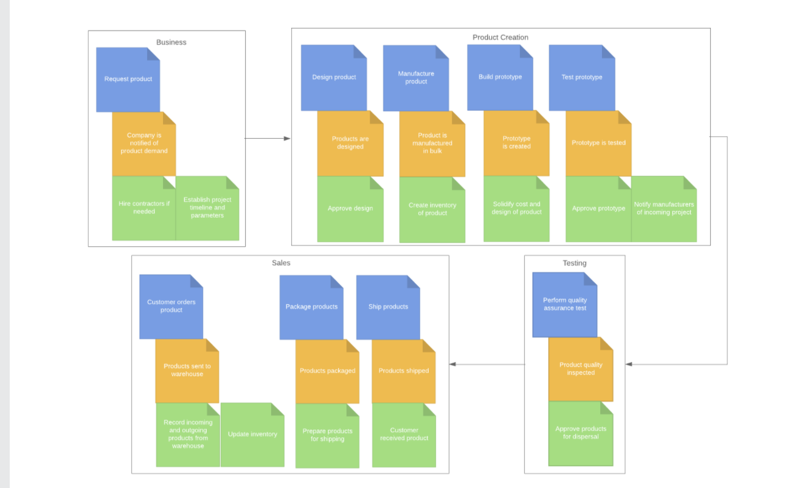
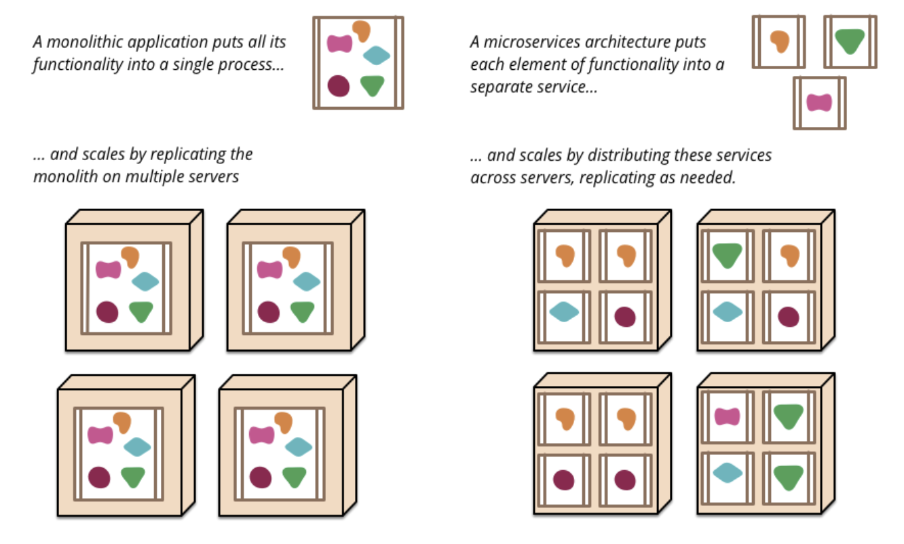
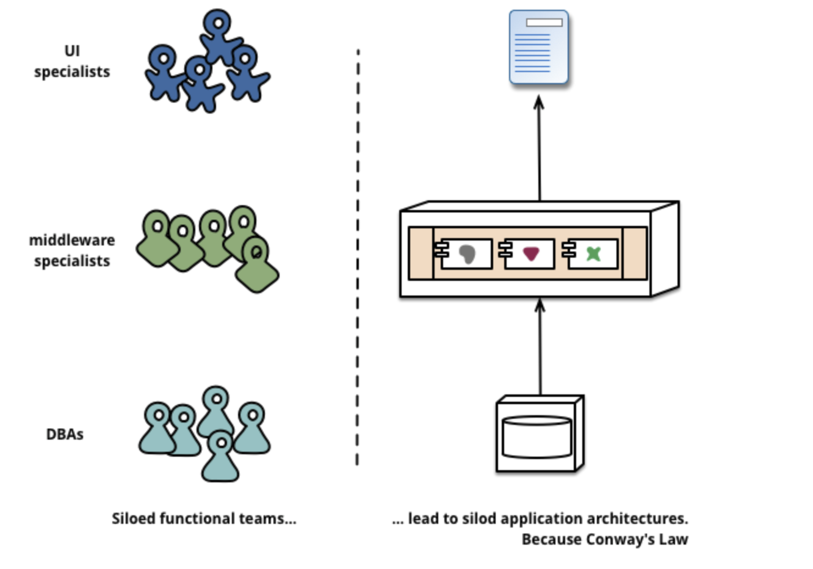
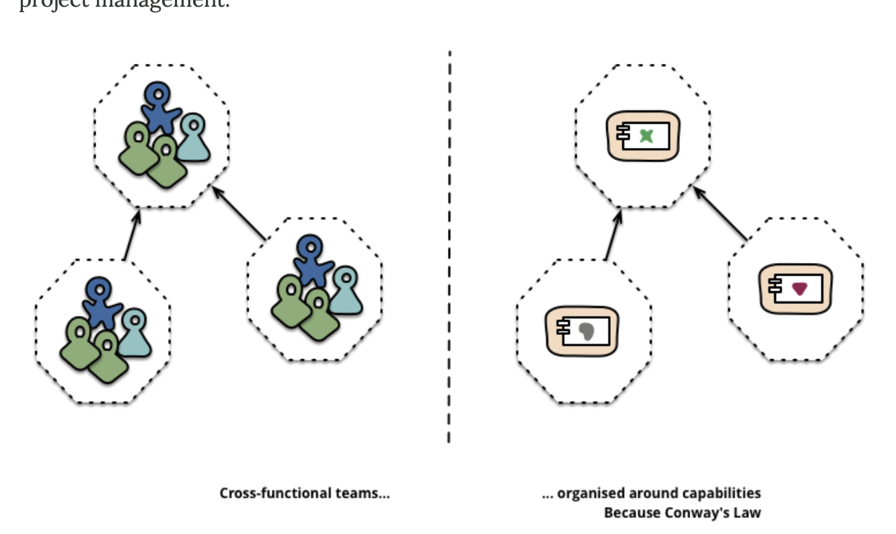
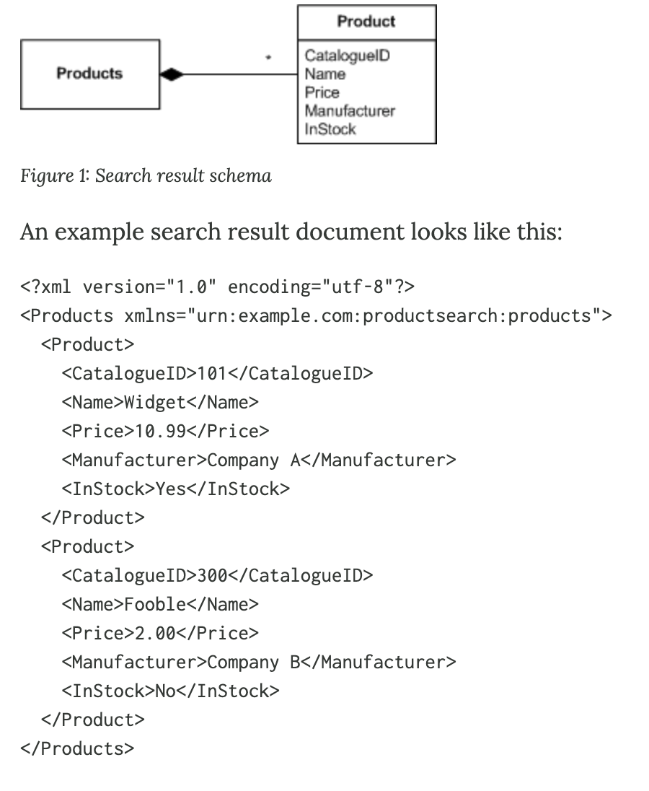
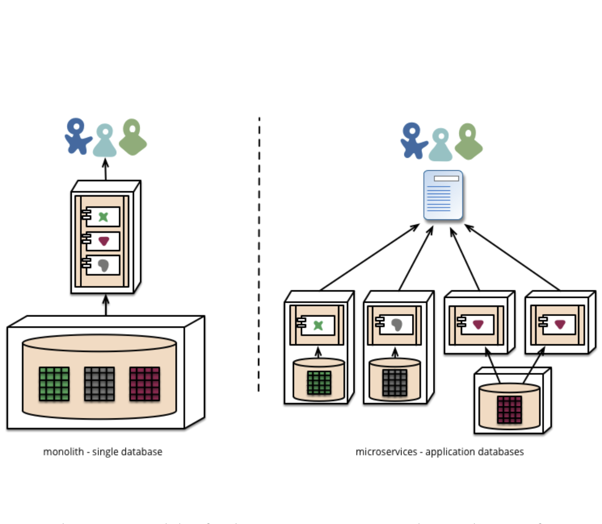
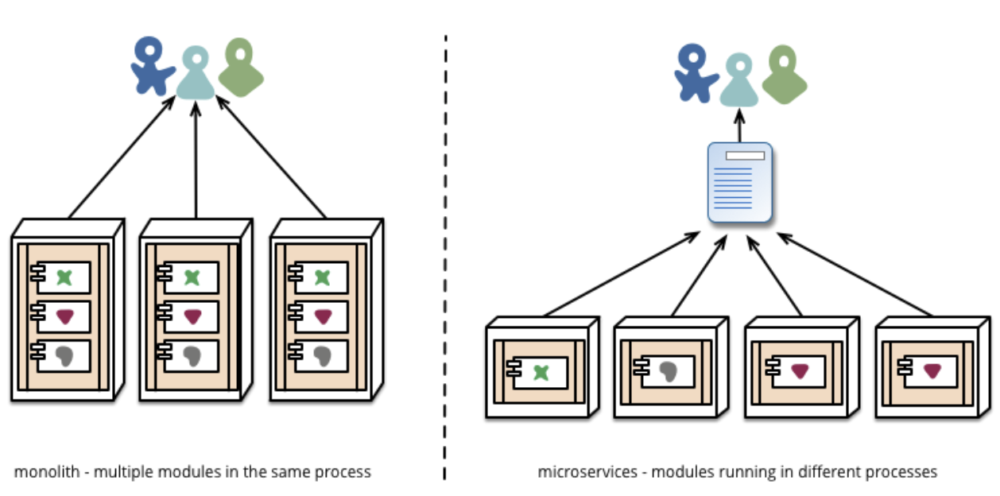
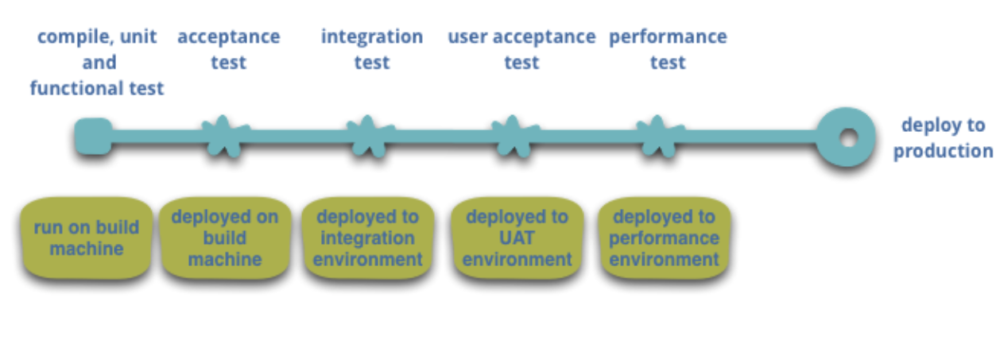

# Domain Driven Design : Takeaways and more ressources

1. DDD has inspirations from the elements of BDD and TDD
   - good article on BDD : `https://dannorth.net/introducing-bdd/`
   - library: `JBehave` - Implement BDD tests , AgileDox: `http://agiledox.sourceforge.net/` : Generate Docs from the Test Cases
   - write clear test with good coverage
   - Test method names should be sentences
   - A simple sentence template keeps test methods focused
   - An expressive test name is helpful when a test fails
     - If we use AgileDox to create docs from the test cases, the readable message makes it easier to find why the test failed.
   - “Behaviour” is a more useful word than “test”
   - JBehave emphasizes behaviour over testing
   - Determine the next most important behaviour
   - ask : "What’s the next most important thing the system doesn’t do?"
   - Requirements are behaviour,too
   - BDD provides a “ubiquitous language” for analysis
   - Acceptance criteria should be executable
2. Domain Language:
   - link : `https://www.domainlanguage.com/ddd/`
   - Event storming : workshop held to learn and discover how business works

3. Application Boundary

   - applications are the body of code, functionality, or group of functionality
   - applications are social constructs
   - applications are :-
     - a body of code seen by developer as a single unit
     - a group of functionality seen by customer as a single unit
     - an initiative that with those money as a single unit

4. Microservices
   > > In short, the microservice architectural style is an approach to developing a single application as a suite of small services, each running in its own process and communicating with lightweight mechanisms, often an HTTP resource API. These services are built around business capabilities and independently deployable by fully automated deployment machinery. There is a bare minimum of centralized management of these services, which may be written in different programming languages and use different data storage technologies.

- James Lewis and Martin Fowler

- Paper: `https://martinfowler.com/articles/microservices.html`

- business application usually consist of three components

  - a client : that runs on users machine made with HTML pages or OS specific application
  - a database : with the persistent storage solution
  - a server : backend of the business application an contains the core business logic

- Here, the server is designed and deployed as a monolith, and any subsequent changes requires versioning a new server with new features.

  - monoliths run on a single process and allow the separation of logic with things like classes, namespaces and functions
  - 
  - all the scaling in the system is done horiztonally by running many instances behind the load balancer
  - even though monolith apps are successfully the cost of change is very high and impractical for many use cases

  - Characters of microservice architecture

    - Componentization via Services :

      - Component- a unit of software that is independently replacable and upgradable

      - Service : a out of process component which can communicate with the mechanism in the system, such as an API or remote procedure call

    - Organized around Business Capabilities

      - " Any organization that designs a system (defined broadly) will produce a design whose structure is a copy of the organization's communication structure." - Melvin Conway\

      - Conway's law in action: 

      - Hence, the effective services and processes in microservices are the ones that are based on the business capabilities of organization and mimic the ongoing business processes

      - Service bounaries reinforced by user boundaries: 

      - the monolithic applications can also be based around business capabilities but are difficult to model and execute

    - Products not Projects

      - monoliths and other models focus on developing apps and services based on project model meaning they work on the system until the project is finished

      - msc architecture promotes the products which the deve teams own over the lifetime of the product. They develop and maintain

    - Smart endpoints and dumb pipes

      - many applications use smart buses for communication but not smart endpoints

        - a good example fo this is the enterprise Service Bus (ESB) which offers message routing, choreography,transformation and applying business rules
        - microseervices architecture instead follows the smart endpoints and dumb pipes architecture
        - apps built on microservices architecture are decoupled and cohesive with their own domain logic and are put together with simple RESTish protocols rather than complicated orchestration mechanism

        - msc teams use principles and protocols that the world wide web is fundamentally built on (or unix to some extent)

        - another common strategy is to use messaging over a simple bus

    - Decentralized goverenance

      - one of the main advantage of the microservices over the monolithic architecture is the decetralization of the requirements and technologies.

      - in centralized system, all the technology definitions are standarized and it is hard to find a hammer that can satisfy all the requirements.

      - in msc you can design your API in one language like CPP, service and repositories in another, and connect them with the client with the simple RESTful services

      - because the entrypoints in the system are well defined it is easier to find and debug the vulnerabilities

      - Helps avoid YAGNI issues.

        - "YAGNI" or "You Aren't Going To Need It" is an XP principle and exhortation to not add features until you know you need them.

      - microservices teamss prefer a different approach to standards too. Rather than use a set of defined standards written down somewhere on paper they prefer the idea of producing useful tools that other developers can use to solve similar problems to the ones they are facing. These tools are usually harvested from implementations and shared with a wider group, sometimes, but not exclusively using an internal open source model. Now that git and github have become the de facto version control system of choice, open source practices are becoming more and more common in-house.

        - Netflix is a good example of an organisation that follows this philosophy. Sharing useful and, above all, battle-tested code as libraries encourages other developers to solve similar problems in similar ways yet leaves the door open to picking a different approach if required. Shared libraries tend to be focused on common problems of data storage, inter-process communication and as we discuss further below, infrastructure automation.

        - **Patterns like Tolerant Reader and Consumer-Driven Contracts are often applied to microservices.**

        - Tolerant Reader: be tolerant and accomodating when reading data from the service, and make assumptions about the data you are receiving. For example if you are consuming XML, only take the data you need. And make assumptions about the schema of the XML you are assuming. Also, having a single bit of code reads the payload is a good use of Tolerant reader pattern.

          - read more: `https://martinfowler.com/bliki/TolerantReader.html`

          - > > be conservative in what you do, be liberal in what you accept from others. : Jon Postel
          - use DTO(Data Transfer objects) to wrap your data

        - Consumer Driven Contracts: consumer driven contracts is the service evolution pattern where services are evolved by adding a field to the schema on behalf of consumers.

          - A service Evolution Pattern

          - for example consider the following XML that we get from the product search result, and is consumed by the two ends an internal marketing application and reseller application. let's say that neither one uses `InStock` field and was dropped later in the development cycle. One of the common way of evolving a service would be to add a field/parm on the behalf of the consumer

          - now let's suppose that a neew reseller wants to join and requires `InStock` field to be present in or requires new `Product Description` field. One way of solving this would be ask the consumer to validate their schema and strip the data away. Or, we could make the change on the provider system and add a field on the behalf of new consumer, and keep the old endpoints same for the old consumers.

          

          - read more: `https://martinfowler.com/articles/consumerDrivenContracts.html`

    - Decentralized data management:

      - conceptual model of the world will differ between systems
      - meaning of same data can be different for two systems and teams. For instance a customer data has different meaning for the sales team and user management team. Or worse, same attributes with subtle changes.
      - making two different models in the decentralizeed database is one of the main issue of microservices architecture, but developers choose do it way because businesses usually have systems to process and deal with such mistakes.
        
      - the monolithic architecture uses transactions to manage the data integrity, and the technique is certainly useful but implmenting distributed transaction systems is notoriously difficult. As a consequence of this: microservice architectures emphasize transactionless coordination between services. more: `http://www.eaipatterns.com/ramblings/18_starbucks.html`

    - Infrastructure automation

      - microservices, unlike monoliths, are deployed with different requirements and are tricky in deploying compared to monoliths.
        
      - but new services like Azure, AWS, and DO we can use CI(Continious Integration)<<"old">> / CD(Continious Delivery) to ensure the development and build popelines of our app.
        
      - the principle behind microservices is to make the deployment process mundane so it won't matter whether we are deplying one or multiple apps.
      - another area of extensive automation is in managing microservices once in production. Tools like Docker, Ansible, and Redis provide execellent tools to deploy microservices automatically.

    - Design for failure

      - as a consequence of using services as components, applications need to be fault tolereant
      - any service could fail due to missing supplier, provider, or any reasons. This is one of the disadvantage of msc compared to monoliths.
      - however, microservices teams constantly reflect on how services failure affect the user experience
      - for e.g. dev Simian Army at Netflix tests the service cascade by shutting down some services.
      - the automated testing in prouction also makes it easier to have some fault prevention due to issues. But, because of the use of choreography and event collaboration, msc apps sometime lead to unexpected emergent behavior. Such serpenditious emergence can affect one or more services and affect user experience.
      - microservices teams should align their attention to maintaing the monitoring and logging of the services and repositories once they are in prouction.

    - Evolutionary Design

      - because of its influences from the evolutionary design, microservices architectures see the service decomposition as a tool to make rapid changes in the feature and the services.

      - when we try to break the system into its components, we should always focus on making components independently replaceable and upgradeable. If you find changing two components at the same time often, it is often a good idea to merge those services into one.

      - in the monoliths, the only way to make any substantial changes is to redploy the entire system. but in msc you only need to redeploy the services you modified but this has a chance of breaking the consumers of the service. This can be handled by using versioning, but the msc approach is to avoid a lot of versioning and make services as tolerant as possible to their suppliers.

    - Trade offs of microservices architecture:

      - very strong module boundaries
      - if the services don't fit properly, then we are relocating the complexity from the system to the connections between the services -- the later on being much harder to debug and control

      - poor teams design poor systems

-
