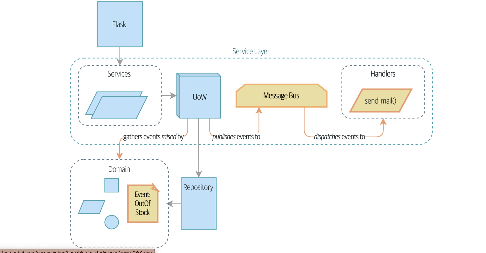

# Notes from the second portion of cosmic python book :smile:

## Event driven architecture

In the first part of the book, we introduced and explored the concepts of domain driven design and how it is useful in creating enterprise applications with focus on models (business logic) and the ease of use for the developers. But we only developed our application with just one model in mind. We designed the model, adapaters for that model, service layer to interact with the persistent storage and the entrypoints to communicate outside of the container.

But, what if we wanted to create application with multiple models that are spread across various locations or systems. In such case, we can use `microservices` architecture to create harmony between the distributed systems. The key term to remember is `messaging`, asynchronous message passing.

- Design at the end of part 1 

- Some more important jargon

- **Domain Events** : trigger workflows that cross consistency boundaries

- **Message Bus** : unified way of invoking use cases from any endpoint

- **CQRS** : Separating reads and writes to avoid compromises in event driven architecture, performance, and scalability

## Events and the Message Bus

- Avoiding making a mess

- Single Responsibility Principle

- The message bus
  - The model records the events
    - events are simple dataclasses/value objects
    - The model raises event
- The message bus maps events to handlers

- Message bus is different from the pooling done with Celery

- our message bus has more in common with an Express.js app, a UI event loop, or an actor framework.

- Options for raising events
     - Option 1: The Service Layer Takes Events from the Model and Puts Them on the Message Bus
    - Option 2: The Service Layer Raises Its Own Events
    - Option 3: The UoW Publishes Events to the Message Bus

